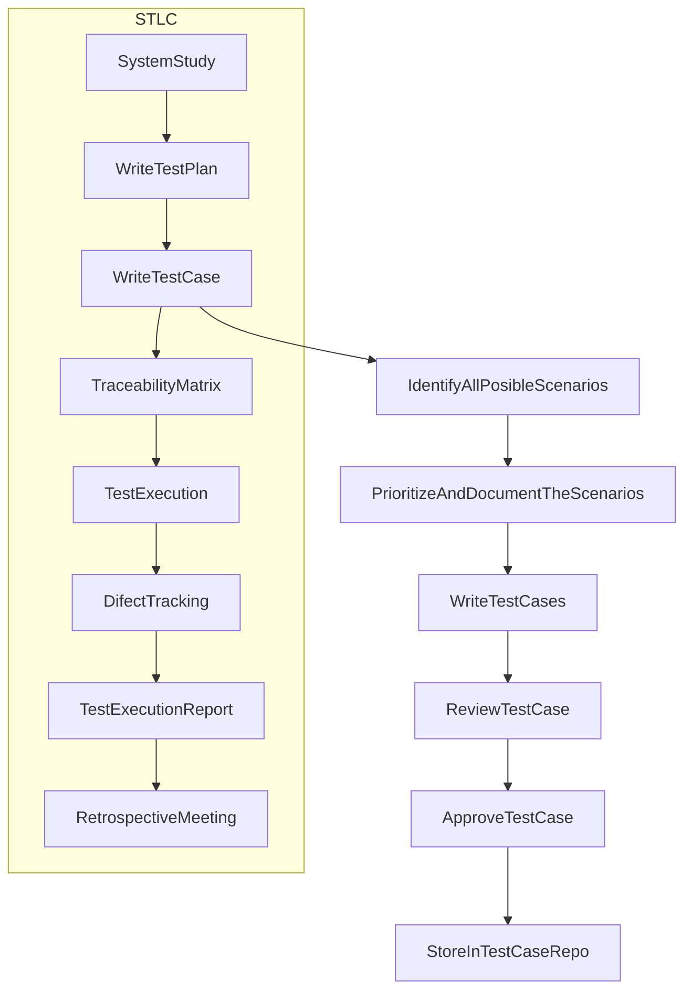
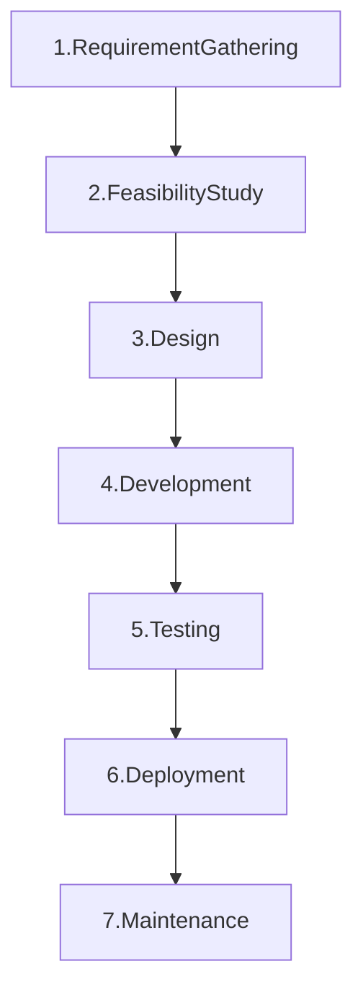
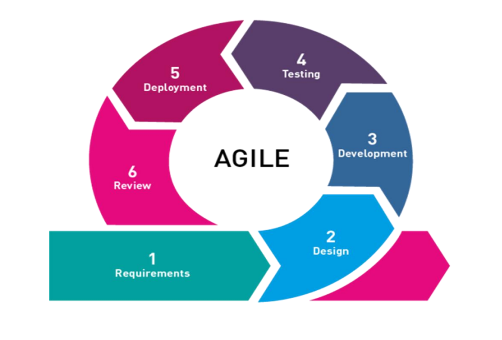
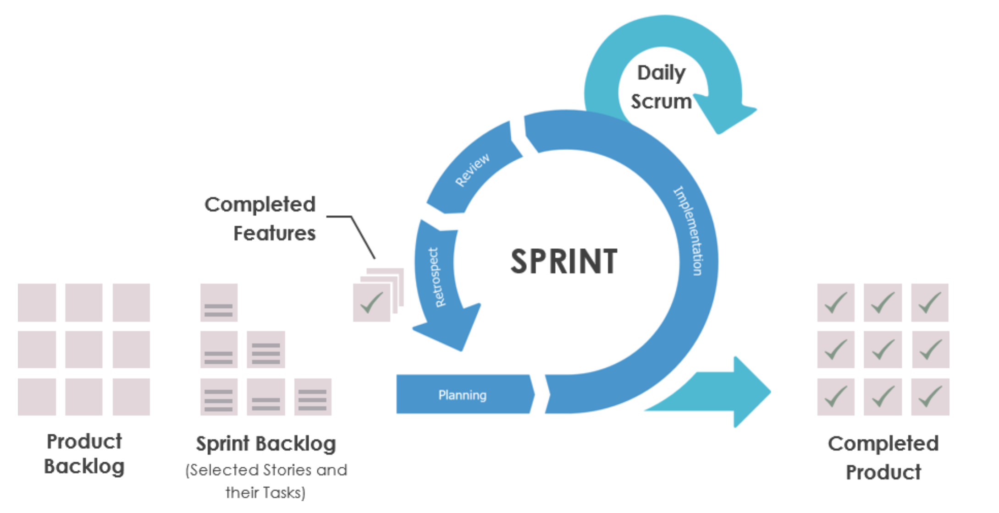
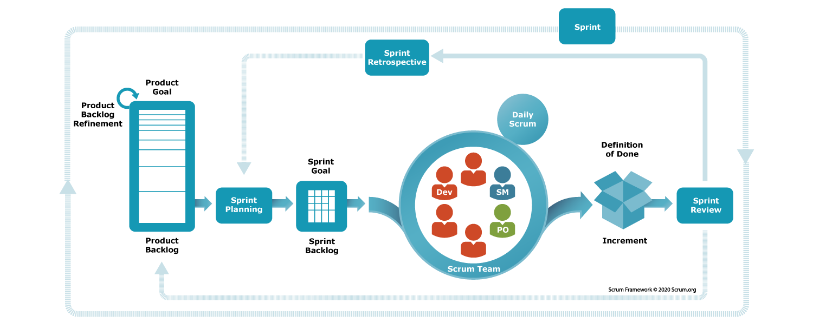

# Manual Testing.

## 1. Types of Testing.
### a. White box testing.
- Testing each & every logic written by the developer is called White box testing.
- it is done by the developers before giving the software to testing team.
- We need programming knowledge to do White box testing.

### b. Black box testing.
- Testing the Functionality or Behaviour of an application againest the Customer Requirement Specification is called Black Box Testing.

#### Types of Black Box Testing.
1. Functional Testing.
2. Integration Testing.
3. System Testing.
4. Acceptance Testing.
5. Smoke Testing.
6. Sanity Testing.
7. Regression Testing.
8. Usability Testing.
9. Ad-hoc Testing.
10. Exploratory Testing.
11. Globalization Testing.
   - Internationalization (I18N) Testing.
   - Localization (L10N) Testing.
12. Compatability Testing.
13. Performance Testing.
14. Accessability Testing.

##### 1. Functional Testing.
`Testing each & every component of an application throughly against customer requirement specification is called Functional testing.`

##### 2. Integration Testing.
`Testing the data flow between two or more dependent modules/features is called integration testing.`

##### 3. System Testing.
`System testing focuses on verifying both functional & non functional requirements.`

##### 4. Acceptance Testing.
`It is an end-to-end testing done by test engineer sitting in the client place where in they take real time business scenarios & check whether the software is working as expected`

##### 5. Smoke Testing.
`Testing the basic/critical features of an application before doing through testing is called smoke testing.`

##### 6. Sanity Testing.
`Sanity testing is done to check that newly added functionalities, bugs, etc., have been fixed.`

**Difference B/w Smoke & Sanity Testing.**
<table>
   <tr>
      <th>Smoke</th>
      <th>Sanity</th>
   </tr>
   <tr>
      <td><ul><li>Smoke test is done to make sure that the critical functionalities of the program are working fine</li></ul></td>
      <td><ul><li>Sanity testing is done to check that newly added functionalities, bugs, etc., have been fixed</li></ul></td>
   </tr>
   <tr>
      <td><ul><li>The software build may be either stable or unstable during smoke testing</li></ul></td>
      <td><ul><li>The software build is relatively stable at the time of sanity testing</li></ul></td>
   </tr>
   <tr>
      <td><ul><li>Smoke testing is done as a part of basic testing</li></ul></td>
      <td><ul><li>Whereas sanity testing is done as part of regression testing</li></ul></td>
   </tr>
   <tr>
      <td><ul><li>Smoke testing is like a general health checkup</li></ul></td>
      <td><ul><li>While sanity testing resembles a specialized health checkup</li></ul></td>
   </tr>
</table>

##### 7. Regression Testing.
`Testing the unchanged modules/features to make sure it is not broken because of new changes is called Regression Testing.`

##### 8. Usability Testing.
`Testing the user friendlyness of an application is called Usability Testing.`

##### 9. Ad-hoc Testing.
`Testing the application randomly without refering any formal documents like Requirement, Test cases & Test Scenarios is called Adhoc Testing.`

##### 10. Exploratory Testing.
`Exploreing the application & understanding all the features, then based on understanding identify all the posible scenarios & document it. Then reffre the document and test the application is called Exploratory testing.`

##### 11. Globalization Testing.
`Testing the software which is developed for multiple languages is called globalization.`

- **Types of Globalization Testing.**
   ###### i. Internationalization (I18N) Testing.
   `Verifying whether the right content is displayed in right language & in right place is called I18N testing.`

   ###### ii. Localization (L10N) Testing.
   `Verifying whether the features are changing locally according to country standard or culture is called L10N testing.`

##### 12. Compatability Testing.
`Testing the application on different platform is called Compatability Testing.`

##### 13. Performance Testing.
`Testing the stability & response time of an application by applying load is called as performance testing.`

##### 14. Accessability Testing.
`Testing the application from physically challenged person's point of view is called as accessibility testing.`

## 2. Test Case Design technique.
- Error guessing technique.
- Equivalence partitioning.
   - Pressmen rule.
   - Practice technique.
- Boundry value Analysis.

## 3. Traceability Matrix
`It is a document which ensures that every requirement got atleast 1 test case.`

## 4. Severity.
`Severity is decided based on the impact of defect on customer bussiness.`

**Levels of Severity are**
- Blocker
- Critical
- Major
- Minor

## 5. Priority.
`Which defect has to be fixed first is decided by priority.`

**Levels of Priority are**
- High
- Medium
- Low

## 6. STLC
- STLC stands for Software Testing Life Cycle.

## 7. SDLC
### a. Introduction to SDLC / What is SDLC.
- SDLC stands for **Software Development Life Cycle**.
- SDLC is a set of processes and methodologies used to develop high-quality software.

### b. Phases of SDLC.

#### 1. Requirement Gathering.
- Will be done by BA/PO (Business Analyst/Product Owner).
- BA/PO Will Create a User Story.

#### 2. Feasibility Study.
- Will be done by a team consists of
   - BA/PO (Business Analyst/Product Owner)
   - PM (Product Manager).
   - Architects.
   - HR Team.
   - Finance Team.

#### 3. Design.
- Will be done by Architects & Sr. Developers.
- Design will be of 2 types.
   - High level design.
   - Low level design.

#### 4. Development.
- Will be done by Developers.

#### 5. Testing.
- Will be done by Test Engineers.

#### 6. Deployment.
- Will be done by DEVOPS Team.

#### 7. Maintenance.
- Will be done by
   - Users.
   - Test Engineers.
   - Support Team.

### c. Models of SDLC / Methodologies of SDLC.
1. Waterfall model. ✔
2. Spiral model. ❌
3. V&V model. ❌
4. Prototype model. ❌
5. Derived model. ❌
6. Hybrid model. ❌
7. Agile model. ✔

#### 1. Waterfall model.
##### i. What is Waterfall model?
- It is a step by step or standerd procedure to develop new software.
- It is also know as Basic model(first), Treditional model(old) or sequential model(step by step).

##### ii. Expline Waterfall model.
###### 1. Requirement Gathering.
   - It is nothing but collecting the requirement from the customer place.
   - It is done by BA/PA.
   - BA will travel from company to customer place & collect the requirement in the form of business language and come back to company and convert business language into software & explain it to Dev, TE, PM, Architect, etc. this process is called as Requirement collection.
   - PA will act like bridge between company and customer.
   
###### 2. Feasibility study.
   - once after requirement collection is done we will go for feasibility study stage/phase.
   - Feasibility study is done by a team consists of PM, BA, Architects, HR team, Finance team
   - This is the stage where company will decide whether to take up the project or not, and if they take up the project then company will check will they have sufficient technologies, sufficient resources, sufficient labsetup. and this is the stage where company will get to know whether they take up the project do they get profit or not. this entire process is called as Feasibility study.
   
###### 3. Design.
   - Once after feasibility study is completed then we will go for Design stage/phase.
   - It is done by Architects.
   - In design there are 2 types.
     1. HLD (High Level Design) - `Designing the architecture of an application is called as HLD`
     2. LLD (Low Level Design) - `Designing each & every individual modules in details is called as LLD`
   
###### 4. Development.
   - Once after design is completed we will go for Coding stage or phase. It is done by developers by looking it the requirement & LLD.
   
###### 5. Testing.
   - Once after coding is completed developers will give software to the test engineers, where in all the test engineers will test the software by entering all the possible inputs into the software to find the defects in the software according to the customer requirement is called as testing.
   
###### 6. Deployment.
   - Once after the testing is completed and software quality is good, we will go for Installation/Implementation stage/phase.
   - It is done by IT engg. / Field engg. / Site engg. / Implementation engg.
   - IT enginerr from the company will travel to the customer place & setup the environment & install the software so that customers can use the software and run the business. this process is call as instalation or implimentation.
   
###### 7. Maintenance.
   - Once after the installation is completed then we go for maintenance phase/stage.
   - Customers while using the software and running the business if they face any problems or if they find any defects then company will give free service(Fixing the defect, testing, and giving the new software) for the customers for a period of 6 months to 1 year based on the agreement between the customer and the company this period is also known as maintenance period. Once after maintenance period is completed, if customers face any problems or if customer need any changes(adding/deleting/modifying the feature) then company will charge for the customer.
   - Maintenance will be done by Developers & Test engineers.

##### iii. Advantages of Waterfall model.
- Since requirement changes are not allowed while testing no of defects will be less.
- Software quality will be super good.
- It is a simple model to follow.
- Initial investment is less.

##### iv. Drawbacks of waterfall model.
- Requirement changes are not allowed.
- Total time taken is more.
- If there is any defect in the requirement it will flow till the coding phase. This leads to lot of reworking and time consuming.

##### v. Interview Questions.
###### 1. Why the model is called as Waterfall model?
   - Here back tracking is not possible, that means once after the feasibility study is completed, requirements will be freazed, we cannot go back and take up the requirement changes. So this model is called as Waterfall model or Sequentiol model.

###### 2. For what kind of projects & applications we can go for waterfall model?
   - For small and simple projects.
   - when customers dont do requirement changes then we can go for waterfall madel.

#### 7. Agile model.

##### i. What is Agile model.
- Agile is a set of principles for software development under which requirements and solutions evolve through the collaborative effort of cross-functional teams.

##### ii. When to Use the Agile Model?
   1. When the project size is large.
   2. When frequent changes are required.
   3. When a highly qualified and experienced team is available.
   4. When a customer is ready to have a meeting with a software team all the time.
   5. Projects with flexible timelines and budget.

##### iii. Agile Methodologies.
   1. **Scrum**: Iterative development with time-boxed sprints, daily stand-up meetings, and roles such as Scrum Master and Product Owner.
   2. **Kanban**: Visual management tool, focusing on continuous delivery and improvement.
   3. **Extreme Programming (XP)**: Emphasizes technical excellence and good design, with practices like pair programming and test-driven development.

##### iv. Scrum.
   - Scrum is a widely used agile methodology/framework in software development. Scrum is
   - Steps/Events involved in scrum activity.
      - Planning meetings.
      - Execution.
      - Daily follow-up.
      - Review meeting.
      - Retrospective meeting.

##### v. Roles.
   1. **Product owner** (PO)/BA.
      - The Product Owner understands the requirements from a customer & communicate the requirements to the product development team.
   2. **Scrum master**.
      - Scrum master is a person who is responsible for delivey of software to the customer within a planned period of time.
      - Scrum master will conduct daily standups.
   3. **Development team**.
      - Development team is responsible for developing a application.
   4. **Testing team**.
      - Testing team is responsible for testing the application and finding bugs before deploying to production.

##### vi. Key Ceremonies.
   1. **Sprint planning** - Define goals and tasks for the sprint.
   2. **Daily Stand-Up** - Short meeting to discuss progress and obstacles.
   3. **Sprint Review** - Review the work done and gather feedback.
   4. **Sprint Retrospective** - Reflect on the sprint and identify improvements.

##### vii. Artifacts.
   1. **Product Backlog** - List of all desired work on the project.
   2. **Sprint Backlog** - List of tasks to be completed in the sprint.
   3. **Increment** - The working product at the end of the sprint.

##### viii. Benefits of Agile & Scrum.
   1. **Flexibility:** Easily adapt to changes in requirements.
   2. **Customer Satisfaction:** Continuous delivery of valuable software.
   3. **Improved Quality:** Regular testing and feedback loops.
   4. **Enhanced Collaboration:** Close collaboration between team members and stakeholders.
   5. **Faster Time-to-Market:** Incremental releases provide early and continuous delivery of valuable software.
   6. **Continuous Improvement:** Regular retrospectives in Scrum drive ongoing enhancements.

##### ix. Sprint. ⭐

