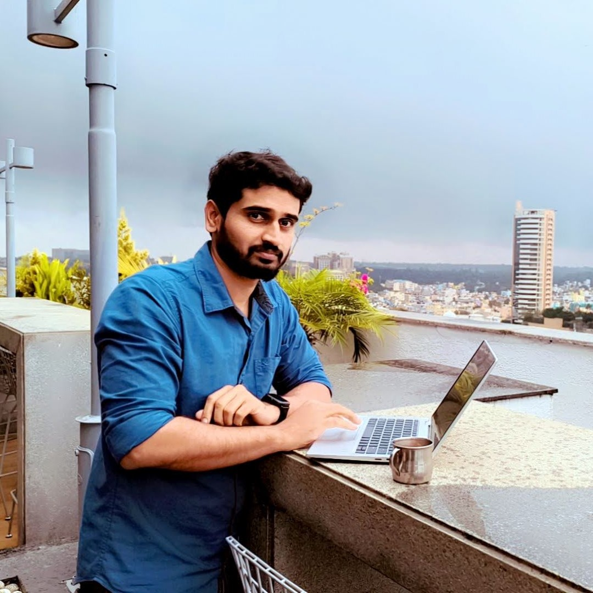

<!-- # 👨‍💻 About Me -->

# &nbsp;&nbsp;About Me

Hi, I'm **Sachin KN** 👋  

A Manual & Automation Test Engineer passionate about building reliable, scalable, and efficient testing solutions.

I enjoy simplifying complex concepts and documenting my learning journey in a practical, interview-focused way.

---

## 🚀 What I Work With

- 🧪 Manual Testing
- 🤖 Playwright Automation
- 🌐 API Testing (RestAssured)
- 🔄 CI/CD with Jenkins
- 🗄 SQL & Database Testing
- 🧰 Git & DevOps Basics

---

## 📚 Why This Website?

This website is my personal knowledge base where I:

- Document practical learning
- Share automation examples
- Write interview-focused notes
- Organize concepts clearly for quick revision

Instead of scattered notes, everything lives here in a structured way.

---

## 🎯 My Focus

- Writing clean and maintainable automation frameworks
- Improving test architecture
- Learning advanced automation patterns
- Continuous improvement in DevOps & CI/CD

---

> "Quality is not an act, it is a habit." – Aristotle